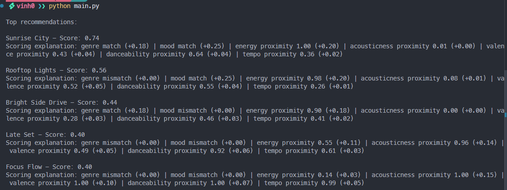

# 🎵 Music Recommender Simulation

## Project Summary

In this project you will build and explain a small music recommender system.

Your goal is to:

- Represent songs and a user "taste profile" as data
- Design a scoring rule that turns that data into recommendations
- Evaluate what your system gets right and wrong
- Reflect on how this mirrors real world AI recommenders

My understanding of how real-world recommendations works:
There are 2 main approaches to building a music recommender system: content-based filtering and collaborative filtering.
Content-based filtering actually examines the features of the songs, such as genre, mood, energy, and tempo, and matches them to the user's preferences. 
While collaborative filtering looks at the behavior of similar users to make recommendations.
Real-world recommenders often use a combination of both approaches, along with machine learning algorithms to improve the accuracy of their recommendations over time.

Here's a simplified version of Youtube's recommendation algorithm:
`Raw signals → Candidate generation → Ranking → Business logic → Served result`
- Candidate generation: The system generates a large pool of potential recommendations based on various signals and heuristics. Since there are millions of videos on YouTube, they cannot score every single video for every user in real-time, so they first narrow down the options to a manageable number of candidates for suggestion.
- Ranking: The candidates are then scored and ranked based on relevance to the user.
- Business logic: The system applies additional business rules to refine the recommendations, such as promoting certain types of content or ensuring diversity in the suggestions.


signals that real-world music recommenders use include:
- explicit user preferences: genres, artists, or songs they have liked or disliked.
- implicit user behavior: listening history, skip rates, and time spent on songs.
- Song features: genre, mood, energy, tempo, and other audio characteristics.
- Social data: what friends are listening to or sharing.
- Contextual data: time of day, location, and device being used.

how these signals are used:
- Explicit preferences help the system understand the user's taste and can be used to directly match songs with similar characteristics.
- Implicit behavior provides insights into the user's actual listening habits and can reveal preferences that the user may not have explicitly stated.
- Song features allow the system to analyze and categorize songs, enabling it to recommend songs that share similar attributes with those the user has liked.
- Social data can enhance recommendations by leveraging the preferences of friends and social connections.
- Contextual data can help tailor recommendations to the user's current situation, such as suggesting upbeat songs in the morning or relaxing music in the evening

The main components of a music recommender system include:
1. **Data Collection**: Gathering data about songs, user preferences, and interactions.
2. **Feature Extraction**: Analyzing songs to extract relevant features such as genre,
mood, energy, and tempo.
3. **User Profiling**: Creating a profile for each user based on their preferences and
interaction history.
4. **Scoring and Ranking**: Developing a scoring mechanism to evaluate how well each song matches the user's profile and ranking the songs accordingly.
5. **Evaluation**: Assessing the performance of the recommender system using metrics such as precision, recall, and user satisfaction.
6. **Feedback Loop**: Continuously improving the system based on user feedback and interactions.

---

## How The System Works

Explain your design in plain language.

Some prompts to answer:

- What features does each `Song` use in your system
  - For example: genre, mood, energy, tempo
- What information does your `UserProfile` store
- How does your `Recommender` compute a score for each song
- How do you choose which songs to recommend

You can include a simple diagram or bullet list if helpful.

### Song Features

Each song is represented by 7 features:

| Feature | Type | Notes |
|---|---|---|
| `genre` | Categorical | pop, lofi, rock, ambient, jazz, synthwave, indie pop |
| `mood` | Categorical | happy, chill, intense, relaxed, focused, moody |
| `energy` | Numerical (0–1) | How loud/active the song feels |
| `acousticness` | Numerical (0–1) | How acoustic vs. electronic |
| `valence` | Numerical (0–1) | Musical positiveness/brightness |
| `danceability` | Numerical (0–1) | How suitable for dancing |
| `tempo_bpm` | Numerical (normalized) | Divided by 200 before scoring |

### User Profile

Stores the user's target preference value for each feature — a mirror of the song feature set:

- `preferred_genre` — e.g. "lofi"
- `preferred_mood` — e.g. "chill"
- `preferred_energy` — e.g. 0.40
- `preferred_acousticness` — e.g. 0.80
- `preferred_valence` — e.g. 0.58
- `preferred_danceability` — e.g. 0.60
- `preferred_tempo_norm` — e.g. 0.375 (75 bpm / 200)

### Scoring Rule

Each song gets a score between 0 and 1 computed as a weighted sum of per-feature scores.

**Categorical features** (genre, mood) — exact match:
- Score = 1.0 if the song's feature matches the user's preference, 0.0 otherwise

**Numerical features** (energy, acousticness, valence, danceability, tempo) — Gaussian proximity:
- Score = exp( -(x - target)² / (2σ²) ), where σ = 0.2
- Returns 1.0 on a perfect match, approaching 0 as the song drifts from the user's preference

**Weighted total:**

| Feature | Weight |
|---|---|
| `mood` | 0.25 |
| `energy` | 0.20 |
| `genre` | 0.18 |
| `acousticness` | 0.15 |
| `valence` | 0.10 |
| `danceability` | 0.07 |
| `tempo` | 0.05 |

### Ranking Rule + Diversity

1. **Filter** — drop any song below a minimum score threshold (e.g. ≥ 0.30)
2. **Sort** — rank remaining songs by total score descending
3. **Diversity cap** — allow no more than 2 songs from the same genre in the final output
4. **Return** top N results (e.g. top 3–5)

### Data flows through the system like this:

```
songs.csv
    ↓
Score each song against UserProfile   ← Scoring Rule (Gaussian + exact match)
    ↓
Filter by minimum threshold
    ↓
Sort by total_score descending         ← Ranking Rule
    ↓
Apply genre diversity cap
    ↓
Return top N recommendations
```

### Potential Biases

**1. Binary categorical penalty**
Genre and mood use exact match scoring (1 or 0). A song that is very close in every numerical feature but differs in genre scores 0 for that feature — no partial credit. This can unfairly bury cross-genre discoveries (e.g. indie pop vs. pop) that a real listener might enjoy.

**2. Categorical weight dominance**
Mood (0.25) and genre (0.18) together account for 43% of the total score. If both are 0, a song can score at most 0.57 even with perfect numerical matches. This biases the system toward staying within the user's stated genre and mood rather than surfacing sonically similar music across boundaries.

**3. Uneven catalog depth across genres**
After adding synthetic data, most genres have 2+ songs, which gives the diversity cap real options to work with. However, three newer genres (hip-hop, r&b, folk) still have only one representative each. A user who prefers one of these will exhaust same-genre options quickly and receive off-genre recommendations not because the system failed, but because the catalog is still shallow for those styles.

**4. Diversity cap working against niche preferences**
The 2-songs-per-genre cap prevents repetitive lists and works well now that most genres have multiple songs. However, for a user with a strong focused preference (e.g. they only want lofi), the cap still limits them to 2 lofi results even though the catalog has 4 lofi songs. A smarter cap would scale with catalog depth per genre rather than applying a fixed number across the board.

**5. Fixed user profile**
The system assumes a single static taste profile. It does not account for context (studying vs. working out), time of day, or a user's evolving preferences. A real listener rarely has one fixed "energy preference."

**6. Uniform sigma across features**
All numerical features use σ = 0.2. This means the scoring is equally forgiving across all features regardless of how much that feature varies in the catalog. Tempo, for instance, spans a much wider real-world range than valence — a single sigma value treats them the same.

---
## Note for grader:
I have already finalized the design with AI before I see the instructions in phase 2 on how simple the scoring logic should be. I think designing a system with more complex math is a valuable learning experience, so I'll continue with this design despite it being more complex than the assignment instructions suggested.

---

## Getting Started

### Setup

1. Create a virtual environment (optional but recommended):

   ```bash
   python -m venv .venv
   source .venv/bin/activate      # Mac or Linux
   .venv\Scripts\activate         # Windows

2. Install dependencies

```bash
pip install -r requirements.txt
```

3. Run the app:

```bash
python -m src.main
```

### Running Tests

Run the starter tests with:

```bash
pytest
```

You can add more tests in `tests/test_recommender.py`.

---

## Results with default "pop/happy" profile
<!-- help me add the "output-with-default-user-profile.png" here -->


---

## Experiments You Tried

Use this section to document the experiments you ran. For example:

- What happened when you changed the weight on genre from 2.0 to 0.5
- What happened when you added tempo or valence to the score
- How did your system behave for different types of users

---

## Limitations and Risks

Summarize some limitations of your recommender.

Examples:

- It only works on a tiny catalog
- It does not understand lyrics or language
- It might over favor one genre or mood

You will go deeper on this in your model card.

---

## Reflection

Read and complete `model_card.md`:

[**Model Card**](model_card.md)

Write 1 to 2 paragraphs here about what you learned:

- about how recommenders turn data into predictions
- about where bias or unfairness could show up in systems like this


---

## 7. `model_card_template.md`

Combines reflection and model card framing from the Module 3 guidance. :contentReference[oaicite:2]{index=2}  

```markdown
# 🎧 Model Card - Music Recommender Simulation

## 1. Model Name

Give your recommender a name, for example:

> VibeFinder 1.0

---

## 2. Intended Use

- What is this system trying to do
- Who is it for

Example:

> This model suggests 3 to 5 songs from a small catalog based on a user's preferred genre, mood, and energy level. It is for classroom exploration only, not for real users.

---

## 3. How It Works (Short Explanation)

Describe your scoring logic in plain language.

- What features of each song does it consider
- What information about the user does it use
- How does it turn those into a number

Try to avoid code in this section, treat it like an explanation to a non programmer.

---

## 4. Data

Describe your dataset.

- How many songs are in `data/songs.csv`
- Did you add or remove any songs
- What kinds of genres or moods are represented
- Whose taste does this data mostly reflect

---

## 5. Strengths

Where does your recommender work well

You can think about:
- Situations where the top results "felt right"
- Particular user profiles it served well
- Simplicity or transparency benefits

---

## 6. Limitations and Bias

Where does your recommender struggle

Some prompts:
- Does it ignore some genres or moods
- Does it treat all users as if they have the same taste shape
- Is it biased toward high energy or one genre by default
- How could this be unfair if used in a real product

---

## 7. Evaluation

How did you check your system

Examples:
- You tried multiple user profiles and wrote down whether the results matched your expectations
- You compared your simulation to what a real app like Spotify or YouTube tends to recommend
- You wrote tests for your scoring logic

You do not need a numeric metric, but if you used one, explain what it measures.

---

## 8. Future Work

If you had more time, how would you improve this recommender

Examples:

- Add support for multiple users and "group vibe" recommendations
- Balance diversity of songs instead of always picking the closest match
- Use more features, like tempo ranges or lyric themes

---

## 9. Personal Reflection

A few sentences about what you learned:

- What surprised you about how your system behaved
- How did building this change how you think about real music recommenders
- Where do you think human judgment still matters, even if the model seems "smart"

